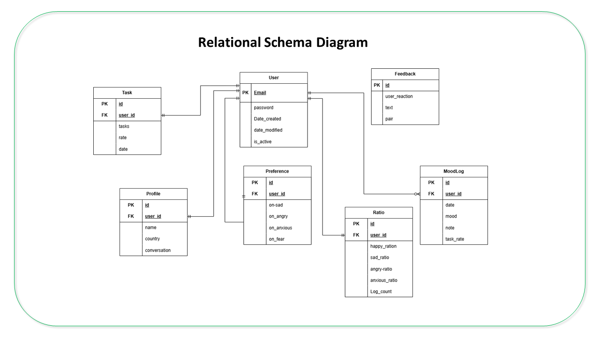
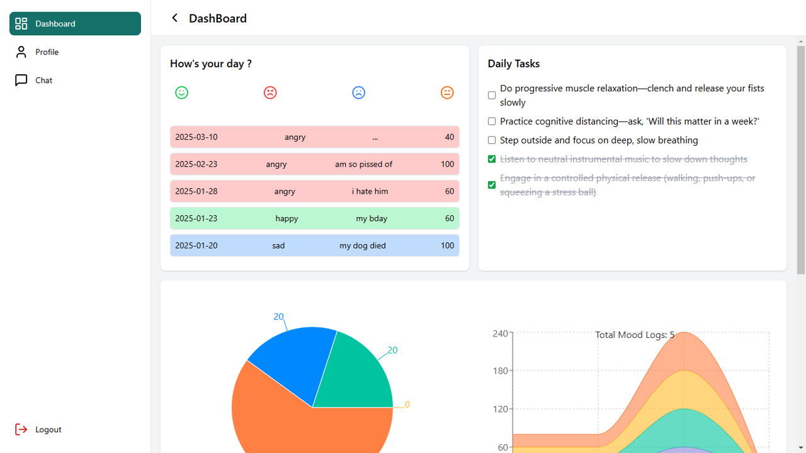
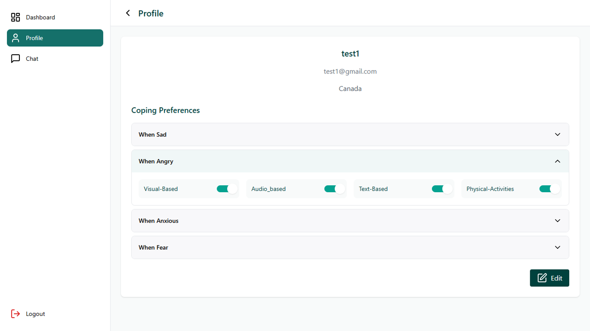

<p align="center">
  
</p>

<p align="center">
  
  
  
  
  
</p>


The Django REST API powering MindCare. This is what makes every conversation **personal**. It tracks emotional patterns over time, classifies users into personality profiles, and hands the chatbot everything it needs to respond like it actually knows the person it's talking to.

---

## 🗂️ Part of the MindCare System

| Repo | Role |
|------|------|
| [`frontend`](https://github.com/silura-008/frontend) | React UI — chat, dashboard, user pages |
| **`backend`** ← you are here | Django REST API — data, auth, Rasa bridge |
| [`bot_parellel`](https://github.com/silura-008/bot_parellel) | Rasa chatbot — NLU, dialogue management |

**Request flow:** React → Django REST API → Rasa

---

## 💡 What The Backend Does

### 🚀 Session Initialization

Every time a user starts a chat session, the backend sends the Rasa bot a personalised context package:
- 🎭 **Personality type** — derived from the user's mood history (Joy, Sorrow, Fury, Nervous, or New)
- 🎛️ **Coping preferences** — the formats the user has selected (text, visual, audio, physical)
- 🆘 **Country-specific helpline** — looked up from an internal dictionary, ready if crisis intervention is needed

Without this, the bot would treat every user identically. This is what makes the responses personalised.
### 🧠 Mood Intelligence

The backend doesn't just store mood entries — it reads them. As a user logs moods over time, their dominant emotional pattern is tracked and used to update their personality classification. That classification feeds into every subsequent conversation.
### 🔁 Feedback Loop

Every bot response can be liked or disliked, with an optional comment. That feedback is stored here — the data foundation for a future reinforcement learning layer.


---

## ✨ Features

- 🔐 **Authentication** — register, login, logout, password reset + confirm
- 👤 **Profile & Preferences** — name, country, coping type (text / visual / audio / physical)
- 📓 **Mood Logging** — daily entries: emotion, personal notes, task completion rate
- 🧠 **Personality Classification** — dominant emotion tracking → Joy / Sorrow / Fury / Nervous / New
- ✅ **Task Management** — daily self-improvement tasks assigned and tracked per user
- 🔥 **Streak Tracking** — consecutive task completion days, stored to power the frontend streak system
- 🤝 **Session Init** — sends personality + preferences + helpline to Rasa at conversation start
- 👍 **Feedback Storage** — per-response like/dislike and user comments
- 🆘 **Crisis Helplines** — country-keyed helpline dictionary served to the chatbot

---

## 🏗️ System Design

### Architecture 


### Database Schema

|**Table**|**Key Fields**|
|---|---|
|**User**|`id`, `email`, `password`, `date_created`, `is_active`|
|**Profile**|`user_id`, `name`, `country`, `conversation`|
|**Preference**|`user_id`, `on-sad`, `on-angry`, `on-anxious`, `on-fear`|
|**MoodLog**|`user_id`, `mood`, `note`, `task_rate`, `date`|
|**Ratio**|`user_id`, `happy_ratio`, `sad_ratio`, `angry_ratio`, `log_count`|
|**Task**|`user_id`, `tasks`, `rate`, `date`|
|**Feedback**|`id`, `user_reaction`, `text`, `pair`|

**Schema Diagram**



---

## 🔌 API Overview

| Endpoint | Method | Description |
|----------|--------|-------------|
| `/api/auth/register/` | POST | Create account |
| `/api/auth/login/` | POST | Authenticate, receive token |
| `/api/auth/logout/` | POST | Invalidate session |
| `/api/auth/password-reset/` | POST | Request reset email |
| `/api/auth/password-reset/confirm/` | POST | Confirm with token |
| `/api/profile/` | GET / PUT | View and update profile + preferences |
| `/api/mood/` | GET / POST | Log mood or retrieve history |
| `/api/mood/analytics/` | GET | 7-day trend data for dashboard |
| `/api/tasks/` | GET / PUT | Fetch tasks, mark completion |
| `/api/session/init/` | POST | Send user context to Rasa |
| `/api/feedback/` | POST | Store response feedback |

---

## 🛠️ Tech Stack

| Component | Technology |
|-----------|-----------|
| Framework | Django 5.x |
| API layer | Django REST Framework |
| Database | SQLite |
| ORM | Django ORM |
| Auth | Token-based |

---

## 🖼️ Screenshots

**Dashboard**


**Profile & Preferences**


---

## ⚙️ Local Setup

```bash
git clone https://github.com/silura-008/backend.git
cd backend
python -m venv venv
source venv/bin/activate        # Windows: venv\Scripts\activate
pip install -r requirements.txt
python manage.py migrate
python manage.py runserver
```

API runs at `http://localhost:8000`

> Rasa must also be running for full chat functionality.  
> See [bot setup](https://github.com/silura-008/bot_parellel).

---

## 🔗 Related Repos

- [**Frontend**](https://github.com/silura-008/frontend) — React UI
- [**Chatbot**](https://github.com/silura-008/bot_parellel) — Rasa Engine
